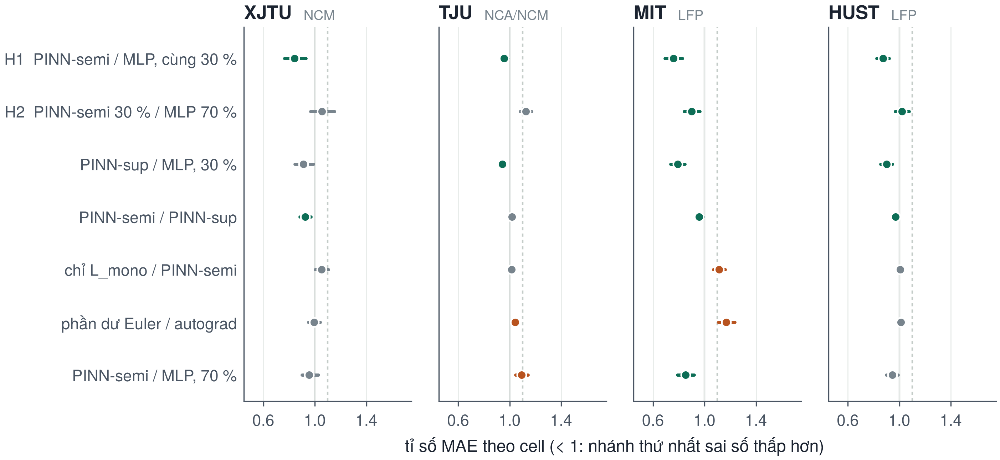
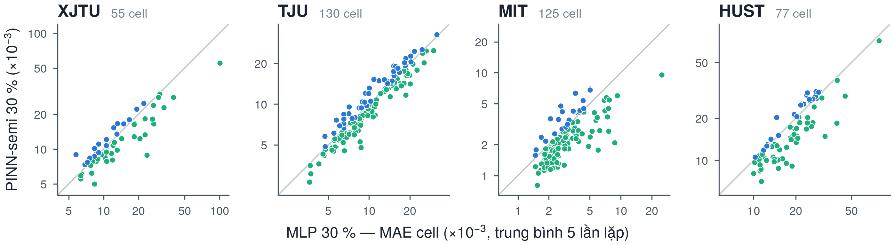
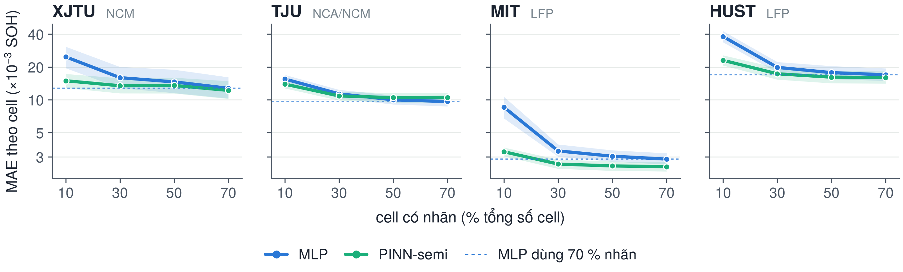
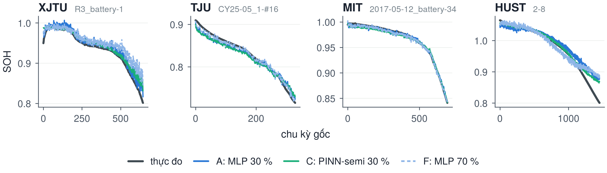

# Kết quả thí nghiệm xác nhận E13 (pipeline v2) và E14

_Sinh tự động bởi `section_e13.py` từ `results/E13_*.csv` — không có số nào gõ tay._

## 1. Vì sao cần E13

Bản rà soát ngày 29/09 chỉ ra năm điểm làm phép so MLP–PINN chưa công bằng hoặc chưa đúng (slide 16) và đề ra khung kết quả còn thiếu (slide 18). E13 sửa cả năm điểm rồi chạy lại phép so dưới một đề cương **ấn định trước**: `tai-lieu/de-cuong-E13.md`, commit `543dbd0`, đẩy lên git trước lượt huấn luyện đầu tiên.

| # | Vấn đề (v1) | Sửa trong v2 | Kiểm chứng |
|---|---|---|---|
| 1 | Lọc 3σ dùng thống kê cả vòng đời cell | Cửa sổ 50 chu kỳ quá khứ, z bền vững > 5 | phá dữ liệu tương lai: 0 quyết định quá khứ đổi |
| 2 | `dropna()` loại hàng thiếu dung lượng | Chỉ loại khi đặc trưng không hữu hạn; nhãn NaN giữ lại | CSV không cột capacity nạp đủ hàng |
| 3 | MLP, PINN fit normaliser trên pool khác nhau | Mọi mô hình fit trên đặc trưng mọi cell train | mu, sd trùng từng bit giữa 3 mô hình |
| 4 | `h` đếm theo hàng sau lọc | Cặp (N, N+h) theo chu kỳ gốc | v1: 27,60 % cặp có Δchu kỳ > h |
| 5 | EOL theo chỉ số hàng, trộn quan sát bị kiểm duyệt | EOL theo chu kỳ, tách bỏ sót / báo giả | khớp đáp án tính tay |

`verify_pipeline.py`: **21/21 phép kiểm đạt**. Chế độ v1 vẫn là mặc định và tái lập **từng bit** dự đoán của các log cũ (đã kiểm trên XJTU và TJU, cấu hình TUNED seed 0).

## 2. Thiết kế

* Kiểm định chéo **5 fold theo cell × 5 lần lặp**, phân tầng theo batch: mỗi cell nằm trong test đúng một lần mỗi lần lặp → mỗi cell có đủ dự đoán test dưới mọi nhánh, ghép cặp theo cell được. Mỗi fold: 70 % train, 10 % validation, 20 % test.
* Validation cần nhãn **ngoài** ngân sách 30 %; giống nhau cho mọi nhánh.
* Cùng mạng (128-128-64, SiLU), cùng tối ưu, cùng dừng sớm theo validation. Khác nhau **chỉ ở hàm mất mát**.
* 11 nhánh, **1100 lượt huấn luyện**. Chỉ số chính: MAE theo cell, trung bình qua các lần lặp; đơn vị kiểm định: cell (Wilcoxon, Holm cho 4 bộ). Độ nhạy: phép t hiệu chỉnh Nadeau–Bengio ở mức fold.

## 3. H1 — PINN-semi so với MLP, cùng 30 % nhãn

| Bộ | Cell | MLP (×10⁻³) | PINN-semi (×10⁻³) | Tỉ số [KTC 95 %] | Cell PINN tốt hơn | p Holm (cell) | p Holm (fold, NB) | Kết luận |
|---|---|---|---|---|---|---|---|---|
| XJTU (NCM) | 55 | 15,95 | 13,44 | 0,843 [0,764; 0,930] | 65 % | 0,0047 | 0,5070 | C tốt hơn |
| TJU (NCA/NCM) | 130 | 11,33 | 10,85 | 0,958 [0,929; 0,986] | 68 % | 0,0041 | 0,5801 | C tốt hơn |
| MIT (LFP) | 125 | 3,40 | 2,58 | 0,758 [0,692; 0,829] | 82 % | < 0,0001 | 0,0110 | C tốt hơn |
| HUST (LFP) | 77 | 19,80 | 17,30 | 0,874 [0,825; 0,920] | 71 % | < 0,0001 | 0,1799 | C tốt hơn |

_Chấm = tỉ số MAE theo cell trung bình; vạch ngang = KTC 95 % bootstrap theo cell (H2: KTC 90 %). Xanh = tốt hơn có ý nghĩa sau Holm; cam = tệ hơn có ý nghĩa; xám = chưa đủ bằng chứng. Vạch dọc liền tại 1 = ngang nhau; vạch đứt tại 1,10 = biên không kém hơn của H2._

_Mỗi chấm là một cell (MAE trung bình 5 lần lặp); dưới đường chéo, màu xanh lục = PINN-semi sai số thấp hơn. Tỉ lệ cell PINN-semi thấp hơn: XJTU 65 %, TJU 68 %, MIT 82 %, HUST 71 %._

## 4. H2 — tiết kiệm nhãn: PINN-semi 30 % so với MLP 70 %

| Bộ | MLP 70 % (×10⁻³) | PINN-semi 30 % (×10⁻³) | Tỉ số [KTC 90 %] | p Holm (cell) | p Holm (fold, NB) | Kết luận (δ = 10 %) |
|---|---|---|---|---|---|---|
| XJTU | 12,74 | 13,44 | 1,055 [0,967; 1,151] | 1,0000 | 0,7669 | chưa chứng minh được |
| TJU | 9,64 | 10,85 | 1,126 [1,083; 1,171] | 1,0000 | 0,7669 | chưa chứng minh được |
| MIT | 2,86 | 2,58 | 0,901 [0,841; 0,962] | < 0,0001 | 0,0316 | không kém hơn (δ = 10 %) |
| HUST | 16,94 | 17,30 | 1,021 [0,969; 1,077] | 0,0351 | 0,5159 | không kém hơn (δ = 10 %) |

Đường cong theo lượng nhãn — MAE theo cell ×10⁻³, **MLP / PINN-semi**:

| Bộ | 10 % | 30 % | 50 % | 70 % |
|---|---|---|---|---|
| XJTU | 24,72 / 14,93 | 15,95 / 13,44 | 14,58 / 13,52 | 12,74 / 12,19 |
| TJU | 15,50 / 13,91 | 11,33 / 10,85 | 9,99 / 10,46 | 9,64 / 10,52 |
| MIT | 8,54 / 3,34 | 3,40 / 2,58 | 3,04 / 2,48 | 2,86 / 2,44 |
| HUST | 37,95 / 22,98 | 19,80 / 17,30 | 17,73 / 16,11 | 16,94 / 15,99 |

_Dải = KTC 95 % bootstrap theo cell; vạch đứt ngang = MLP dùng 70 % nhãn (mốc của H2); trục dọc thang log. Kiểm định chéo 5 fold × 5 lần lặp, pipeline v2._

## 5. So sánh phụ (thăm dò) — tỉ số MAE theo cell, * = p Holm < 0,05

| So sánh | XJTU | TJU | MIT | HUST |
|---|---|---|---|---|
| PINN-sup / MLP (regularization) | 0,912 | 0,942* | 0,791* | 0,900* |
| PINN-semi / PINN-sup (cell không nhãn) | 0,924* | 1,016 | 0,958* | 0,970* |
| chỉ L_mono / PINN-semi (ích lợi ODE) | 1,051 | 1,014 | 1,112* | 1,006 |
| Euler dọc quỹ đạo / autograd | 0,995 | 1,043* | 1,168* | 1,011 |
| PINN-semi / MLP ở 70 % | 0,957 | 1,091* | 0,852* | 0,944 |
| PINN-semi / MLP ở 10 % | 0,604* | 0,897* | 0,391* | 0,606* |
| PINN-semi / MLP ở 50 % | 0,927 | 1,046 | 0,815* | 0,909* |

## 6. Chỉ số phụ — sai số EOL, tính hợp lý của quỹ đạo

| Bộ | Nhánh | MAE cell ×10⁻³ | MAE SOH ≤ 0,9 ×10⁻³ | EOL MAE (chu kỳ) | bỏ sót / báo giả | vi phạm đơn điệu /100 ck | jitter ×10⁻³ |
|---|---|---|---|---|---|---|---|
| XJTU | MLP 30 % | 15,95 | 24,83 | 27,2 | 17 / 5 | 0,303 | 6,73 |
| XJTU | PINN-semi 30 % | 13,44 | 22,65 | 16,9 | 43 / 0 | 0,136 | 3,23 |
| XJTU | MLP 70 % | 12,74 | 21,41 | 15,7 | 31 / 3 | 0,268 | 6,08 |
| TJU | MLP 30 % | 11,33 | 9,30 | 25,4 | 7 / 15 | 0,185 | 4,56 |
| TJU | PINN-semi 30 % | 10,85 | 8,99 | 22,1 | 9 / 12 | 0,097 | 2,79 |
| TJU | MLP 70 % | 9,64 | 7,77 | 20,4 | 7 / 17 | 0,172 | 4,32 |
| MIT | MLP 30 % | 3,40 | 5,56 | 18,9 | 28 / 19 | 0,106 | 2,47 |
| MIT | PINN-semi 30 % | 2,58 | 3,50 | 17,0 | 21 / 12 | 0,048 | 1,27 |
| MIT | MLP 70 % | 2,86 | 4,00 | 17,5 | 30 / 7 | 0,094 | 2,22 |
| HUST | MLP 30 % | 19,80 | 38,31 | 132,5 | 124 / 0 | 0,264 | 5,42 |
| HUST | PINN-semi 30 % | 17,30 | 34,91 | 116,8 | 157 / 0 | 0,097 | 2,07 |
| HUST | MLP 70 % | 16,94 | 32,32 | 116,1 | 135 / 0 | 0,230 | 4,74 |

_EOL tại ngưỡng SOH 0,85, tính trên chu kỳ gốc; sai số chỉ lấy trên các cặp (cell, lần lặp) mà cả nhãn lẫn dự đoán cùng cắt ngưỡng; "bỏ sót" = nhãn cắt nhưng dự đoán không cắt._

_Cell có MAE của MLP 30 % đúng trung vị mỗi bộ (quy tắc chọn không phụ thuộc PINN), lần lặp 0. MAE ×10⁻³ (MLP 30 % / PINN-semi 30 % / MLP 70 %) — XJTU R3_battery-1: 10,6 / 8,2 / 16,2; TJU CY25-05_1-#16: 9,0 / 10,2 / 5,0; MIT 2017-05-12_battery-34: 2,6 / 3,8 / 2,3; HUST 2-8: 17,5 / 10,0 / 15,7._

## 7. E14 — chuyển miền với cùng normaliser

| Nguồn → đích | k | MLP | PINN-semi | Tỉ số | seed PINN thắng |
|---|---|---|---|---|---|
| HUST → MIT | 0 | 2,4452 ± 0,7102 | 0,0260 ± 0,0023 | 0,011 | 5/5 |
| HUST → MIT | 3 | 0,1365 ± 0,2285 | 0,0076 ± 0,0017 | 0,055 | 5/5 |
| MIT → HUST | 0 | 0,5423 ± 0,0896 | 0,0583 ± 0,0023 | 0,108 | 5/5 |
| MIT → HUST | 3 | 0,0306 ± 0,0111 | 0,0256 ± 0,0112 | 0,838 | 5/5 |
| TJU → XJTU | 0 | 1,9983 ± 0,5680 | 0,0951 ± 0,0209 | 0,048 | 5/5 |
| TJU → XJTU | 3 | 0,0303 ± 0,0166 | 0,0285 ± 0,0155 | 0,939 | 2/5 |
| XJTU → TJU | 0 | 1,4780 ± 0,2226 | 0,0383 ± 0,0023 | 0,026 | 5/5 |
| XJTU → TJU | 3 | 0,3219 ± 0,4037 | 0,0337 ± 0,0075 | 0,105 | 5/5 |

_MAE theo cell trên tập test của bộ đích, trung bình ± SD qua 5 seed. Cả hai mô hình fit normaliser trên cùng pool đặc trưng nguồn + đích; chỉ khác loss vật lý._

## 8. Kết luận theo quy tắc đã ấn định

* H1 (cùng 30 % nhãn): PINN-semi có MAE theo cell thấp hơn MLP, có ý nghĩa sau hiệu chỉnh Holm, trên 4/4 bộ (XJTU, TJU, MIT, HUST).
* Phép t hiệu chỉnh ở mức fold (bảo thủ hơn, tính cả biến thiên do huấn luyện lại) chỉ xác nhận 1/4 bộ (MIT) — kết luận phụ thuộc đơn vị phân tích, nên phát biểu mạnh chỉ dành cho các bộ qua cả hai phép kiểm.
* H2 (PINN-semi 30 % so với MLP 70 %, biên 10 %): không kém hơn trên 2/4 bộ (MIT, HUST).
* Trên XJTU, TJU chưa chứng minh được tiết kiệm nhãn ở biên 10 %.
* Với phép t mức fold, H2 chỉ đứng vững trên 1/4 bộ (MIT).

